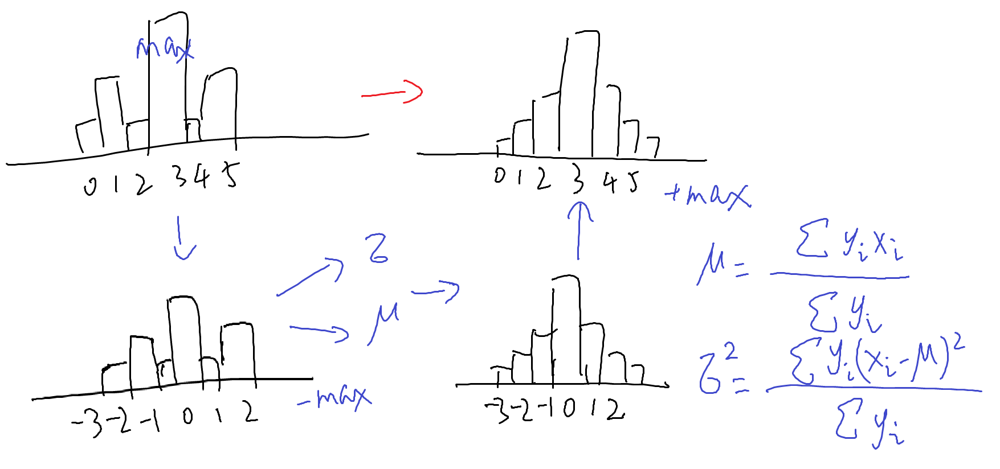

Transformation Distribution
============
Other common distributions are generated according to the mean and variance of the input distribution(vector, where the element is the corresponding probability value of random variable)

toNorm
-------
According to the mean and variance of any distribution, the corresponding normal distribution is generated. You can reset the peak position.

toUniform
---------
Generate the distribution with the same probability value at other positions except the peak, and make the mean and variance of the new distribution equal to the original distribution